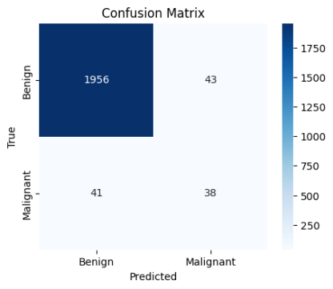
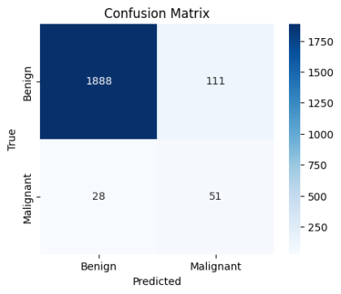
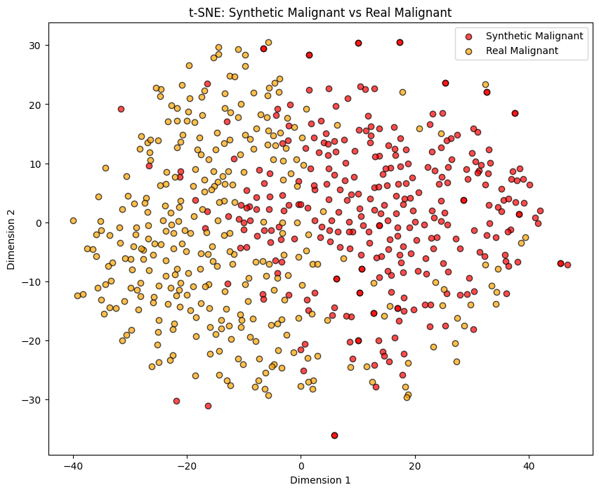
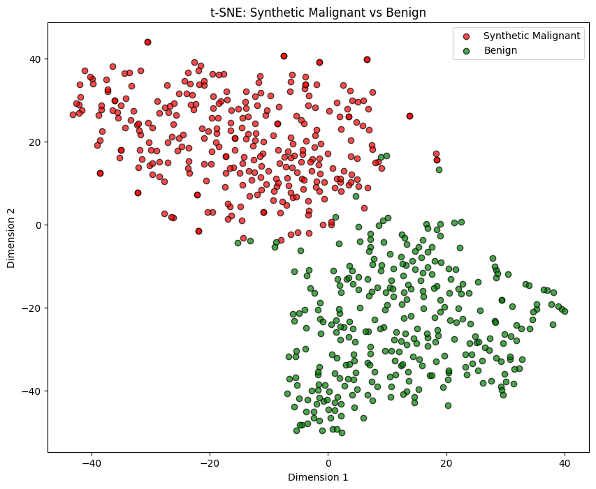
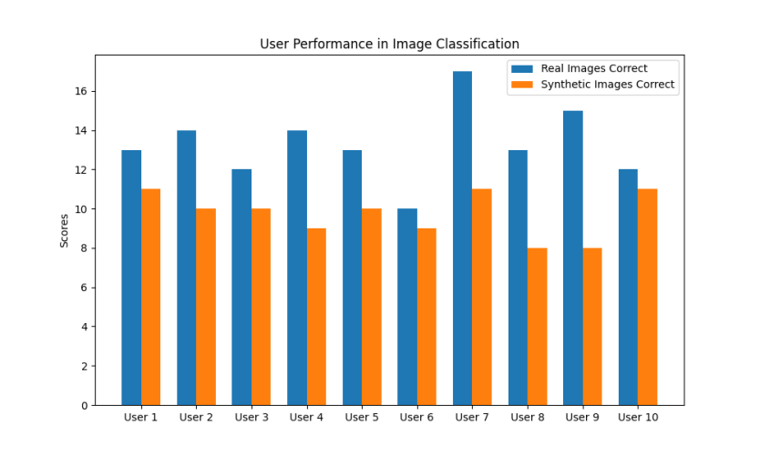
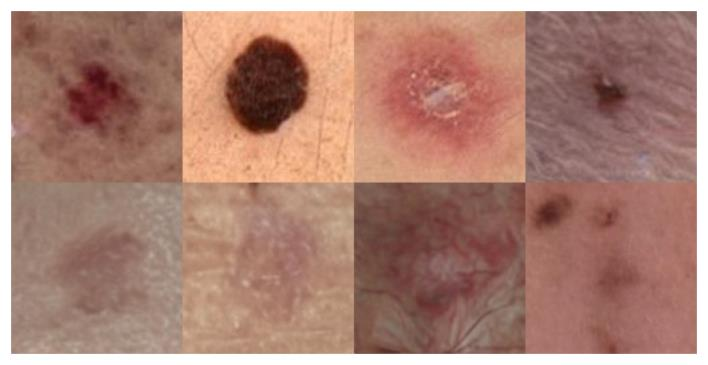

## Generative Models for Imbalanced Skin Lesion Datasets

This project explores the use of diffusion-based generative models to address severe class imbalance in medical imaging, specifically for skin lesion classification. By fine-tuning a Stable Diffusion 1.5 model, we successfully generated high-fidelity synthetic malignant lesions.

The primary goal was to create a balanced dataset to improve a classifier's ability to correctly identify malignant cases (i.e., improve recall), which is critical for early diagnosis and patient outcomes.

## The Problem: Extreme Class Imbalance

In medical datasets, benign (non-cancerous) samples often vastly outnumber malignant (cancerous) ones. Our project sourced data from the ISIC 2024 dataset, which presents an extreme example of this problem: over 400,000 benign images versus only 315 malignant images.

As training on the full 400k+ images was computationally prohibitive, we constructed our primary working dataset (DS1) by sampling 8,000 benign images and using 314 real malignant images.

When a classifier is trained on this severely imbalanced dataset (DS1), it becomes heavily biased toward the majority class (benign). This results in a model that performs poorly on the minority class, leading to a high number of false negatives (missing actual malignant cases). Our baseline classifier (B0) trained on this data had a recall of only 9%.

## Methodology

We used  Stable Diffusion 1.5 model fine-tuned with Low-Rank Adaptation (LoRA)  to generate new, synthetic malignant images.

### 1. How Diffusion Models Work

Diffusion models learn to generate images by reversing a "noising" process. They are trained to take a 'noisy' or scrambled image and progressively 'denoise' it, step-by-step, until a clean, coherent image emerges. Our fine-tuning process teaches the model to guide this denoising process toward generating specific types of images: malignant skin lesions.

   
  <em>Figure 1: Denoising steps using "malignant skin lesion" as a prompt</em>

### 2. Data Preprocessing

All images in our dataset (which ranged from 88x88 to 322x322 pixels) were resized to a uniform 128x128. This resolution was chosen over the model's standard 512x512 to avoid upscaling artifacts that distorted critical lesion details. Pixels were normalized to a [-1, 1] range , and a color normalization step was applied to correct for lighting variations.

### 3. Prompt Engineering: The Critical Factor

Initial experiments with simple prompts (e.g., "malignant skin lesion") failed to guide the model effectively. To fix this, we developed a simple web application that allowed for manual, structured labeling of each training image.

This app captured key features such as:
  
  - Lesion color
  - Size and shape
  - Border characteristics
  - Surrounding skin tone
  
  The app then combined these selections into consistent, richly descriptive natural-language prompts, which were essential for guiding the model effectively.

  ### 4. Model Fine-Tuning

  We fine-tuned the model in two phases:
  
  1. U-Net Only: First, we fine-tuned only the U-Net component, which is responsible for the denoising process. This improved lesion shapes, but the surrounding skin texture looked artificial.
  2. U-Net + Text Encoder: In the second phase, we trained the U-Net and the text encoder simultaneously. This allowed the model to create a stronger alignment between our descriptive prompts and the visual details, resulting in much more natural-looking skin textures.

Optimal results achieved after ≈ 1400 steps at a resolution of 128×128, using AdamW (lr = 3e-5) and FP16 mixed precision on NVIDIA A100 GPUs.

### 5. Evaluation Setup

- Classifier: ResNet-50 trained on two datasets:
  - DS1: Real data only
  - DS2: Real + Syntethic malignant samples
- Metrics: Recall, AUROC and AUPRC
- Independent test set held out for evaluation.

## Results

We evaluated our synthetic data both quantitatively (does it improve classifier performance?) and qualitatively (does it look real?).

### Quantitative Results: Boosting Classifier Recall

We tested five different experiments to measure the impact of our synthetic data. The test set was kept separate and contained 2000 benign and 79 real malignant images.

| Experiment | Training Set | Augmentation | Weighted Loss | Recall   | AUROC | AUPRC |
| ---------- | ------------ | ------------ | ------------- | -------- | ----- | ----- |
| **B0**     | DS1          | ✗            | ✗             | 0.09     | 0.887 | 0.306 |
| **A1**     | DS1          | ✓            | ✗             | 0.37     | 0.862 | 0.417 |
| **W1**     | DS1          | ✓            | ✓             | 0.48     | 0.900 | 0.464 |
| **S2**     | DS2          | ✓            | ✗             | **0.65** | 0.900 | 0.433 |
| **S2w**    | DS2          | ✓            | ✓             | 0.49     | 0.882 | 0.467 |

The two most important experiments were:

- W1 (Baseline): Trained on the original imbalanced dataset (DS1) using traditional augmentation and a weighted loss function to help the minority class.
- S2 (Our Method): Trained on a new dataset (DS2) that included 314 of our synthetic malignant images, doubling the malignant class.

The results were a clear success. Adding synthetic images boosted recall from 48% to 65%.

   

Confusion matrices comparing performance W1 (left) and S2 (right) introducing synthetic images.

### Qualitative Results: "Visually Convincing" Images

#### 1. t-SNE Feature Visualization

We used t-SNE to compress the high-dimensional features from our classifier and plot them in 2D.

- Synthetic vs. Real: The features of our synthetic malignant images (red) show a clear and significant overlap with the features of real malignant images (yellow/orange). This shows our model learned to reproduce the correct features.
- Synthetic vs. Benign: The synthetic malignant images (red) form a distinct cluster that is clearly separated from the benign images (green).

   <em>Real vs. Synthetic Malignant: strong overlap indicates feature fidelity.</em> 
 
   <em>Synthetic Malignant vs. Benign: clear separation, confirming diagnostic distinction.</em> 
 

This confirms our synthetic images effectively mimic the malignant class while remaining distinct from the benign class.

#### 2. Human Expert Study

We asked 10 participants (doctors and senior medical students) to act as "discriminators". They were shown a random sequence of 40 malignant images (20 real, 20 synthetic) and had to classify each as real or synthetic.

- Real Images: Experts correctly identified 66.5% of the real images on average.
- Synthetic Images: Experts correctly identified only 49.5% of the synthetic images on average.

  

This at-chance (50/50) performance on synthetic images demonstrates that our generated lesions are "visually convincing" and that medical experts could not reliably distinguish them from real ones.

## Generated Examples and Demo

   <em>Examples of our synthetic images generated using our diffusion-based approach.</em>

## Conclusion
This project demonstrates that synthetic data generation can serve as a powerful tool to correct class imbalance in medical imaging datasets.
Fine-tuned diffusion models, guided by high-quality descriptive prompts, produced realistic malignant lesions that:

- Improved recall by +17 points.
- Preserved benign accuracy.
- Achieved strong perceptual and feature-space realism.

These findings highlight the potential of synthetic medical data to support both AI training and clinical education in dermatology.